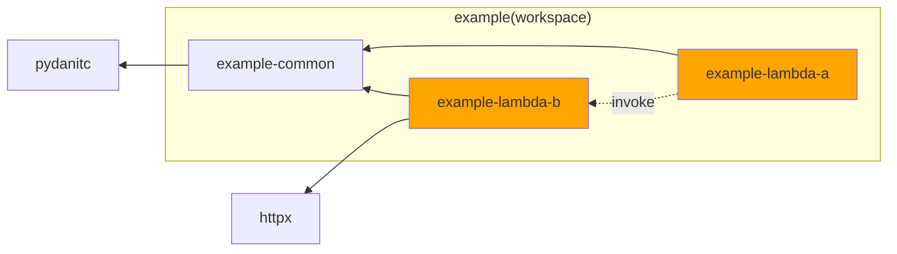

# uv workspaceでAWS Lambdaを管理すると便利

こんにちは。アミフィアブル株式会社のAIチームでPythonエンジニアをしている小林です。
今回は、複数のAWS Lambda関数(以下Lambda)とその依存関係を管理する方法を検討したところ、[uv](https://docs.astral.sh/uv/)のworkspace機能との相性が良かったのでご紹介します。

## 想定読者

- uvを触ったことがあり、基本的なコマンドを把握している(`uv add`・`uv export`等)
- AWSでPythonのLambdaをデプロイした事があり、依存パッケージの管理方法に課題を感じている

## Lambdaをuvで管理するモチベーション

Lambdaをuvで管理する事によって以下のような課題が解決できます。

### 1. 複数のLambdaのソースコードと、その依存パッケージをuvで一元管理したい
uvの特徴である高速な依存関係の解決やパッケージのキャッシュなどをLambdaの開発でも活用したいです。
また、依存パッケージを一元管理することで、Lambda間でパッケージのバージョンを統一し、バージョンアップ対応をより簡単に行いたいです。

### 2. Lambdaごとに必要最低限の依存関係のみデプロイしたい
Lambdaのコードサイズはコールドスタートの時間に影響します。必要なパッケージのみをデプロイすることで起動時間の短縮をしたいです。

### 3. Lambda間で共有するモジュールを管理したい
ユーティリティ関数が定義された共有モジュールやその共有モジュールへの依存関係を管理し、デプロイ時に適切に選択したり適切な静的解析が行われるようにしたいです。

### 4. 環境間で同じバージョンのパッケージをデプロイしたい
開発環境で検証したものと同じバージョンの依存パッケージがデプロイされるようにすることで、環境差異にによるエラーを回避したいです。


## uv workspaceについて
uvのworkspace機能は、**複数のPythonパッケージ(ワークスペースメンバー)のパッケージ依存関係を一元管理する**ことを目的としています。
今回は複数のLambdaをそれぞれ別のPythonパッケージとして管理することで、依存関係やビルドをPython標準に則った形で実行します。
workspaceのメンバに対して依存パッケージの追加等の操作をするにはコマンドに`--package <PACKAGE>`を追加します。

```console
uv add --package member-name requests
uv export --package member-name
```

---

それでは見ていきましょう!!

---

## サンプルプロジェクト

今回作成したプロジェクトはGitHubで公開しています。

https://github.com/bayashi-cl/uv-workspace-managed-lambda-example

プロジェクト内の各パッケージの依存関係は以下のようになっています。

`example-lambda-a`が`example-common`にあるクラスを介して`example-lambda-b`を呼び出し、`example-lambda-b`が`httpx`を使用して外部APIを呼び出し処理を実行するイメージです。




### exampleパッケージ(ルートパッケージ)

開発環境でのみ必要なパッケージ(mypy, pytest)はこのパッケーの`dependency-groups`に追加します。

```console
uv add --dev mypy pytest
```

仮想環境にワークスペースメンバーのパッケージ(とその依存パッケージ)をインストールするために、パッケージの`dependencies`にワークスペースメンバーを追加します。

```console
uv add example-lambda-a example-lambda-b example-common
```

### example-common(共有パッケージ)

uvがワークスペース内のパッケージを自動で検索してくれるので、共有パッケージへの依存関係を外部のパッケージと同じように指定する事ができます。

```console
uv add --package example-lambda-a example-common
uv add --package example-lambda-b example-common
```

### example-lambda-a/b(Lambda用パッケージ)
各Lambdaに固有の依存パッケージがある場合はここで定義します。

```console
uv add --package example-lambda-b httpx
```


## ビルド
Lambdaをデプロイするため、uvの[Lambda統合ガイド](https://docs.astral.sh/uv/guides/integration/aws-lambda/)を参考に必要なパッケージ群をまとめたzipアーカイブを作成します。

大枠の流れとしては以下のようになります。

1. `pyproject.toml`と`uv.lock`をもとに`requirements.txt`を生成する(`uv lock`コマンド)
2. `requirements.txt`に出力されたパッケージ群を一時ディレクトリにインストールする(`uv pip install`コマンド)
3. 一時ディレクトリをzip化し、Lambdaのデプロイパッケージとする


## uv workspaceの弱点とその対策

workspaceの弱点として、**不正な依存関係の検知ができない**というものがあります。
例えば、以下のように`example-lambda-a`の依存関係の依存関係から`example-common`を削除した状態であっても、ローカル環境での実行やmypyの静的解析ではエラーは発生しません。しかし、デプロイされたLambdaを実行するとImportErrorが発生します。

```toml:packages/example-lambda-a/pyproject.toml
[project]
name = "example-lambda-a"
dependencies = [
    "boto3>=1.40.31",
    # "example-common",
]
```

原因は、workspaceが依存関係を単一の仮想環境で一括管理する仕組みにあります。これにより、明示的に定義していない依存関係のパッケージもインストールされてしまうため、ローカル環境では問題なく実行できてしまいます。

対策として、[nox](https://nox.thea.codes/)でパッケージごとの仮想環境を作成し、そこで型チェックを行うことで不正な依存関係を検知します。

```py:noxfile.py
@nox.session(venv_backend="uv")
@nox.parametrize("package", packages)
def type_check(session: nox.Session, package: str) -> None:
    session.run_install(
        "uv",
        "sync",
        "--active",  # noxによって作成された仮想環境にパッケージを追加する
        "--frozen",
        f"--package={package}",  # 指定されたパッケージの依存関係のみをインストールする
    )
    session.run("mypy", "--strict", f"packages/{package}")
```

`example-project-a`から`example-common`への依存関係が削除された状態で`nox`を実行すると以下のようなimport-not-foundエラーが発生します。

```console
❯ uv run nox
nox > Running session type_check(package='example-lambda-a')
nox > Creating virtual environment (uv) using python3 in .nox/type_check-package-example-lambda-a
nox > /home/******/.local/bin/uv sync --active --frozen --package=example-lambda-a
Installed 5 packages in 46ms
 + example-lambda-a==0.1.0 (from file:///home/******/uv-workspace-managed-lambda-example/packages/example-lambda-a)
 + mypy==1.18.1
 + mypy-extensions==1.1.0
 + pathspec==0.12.1
 + typing-extensions==4.15.0
nox > mypy --strict packages/example-lambda-a
packages/example-lambda-a/src/example_lambda_a/__init__.py:3: error: Cannot find implementation or library stub for module named "example_common"  [import-not-found]
packages/example-lambda-a/src/example_lambda_a/__init__.py:3: note: See https://mypy.readthedocs.io/en/stable/running_mypy.html#missing-imports
packages/example-lambda-a/src/example_lambda_a/__init__.py:7: error: Returning Any from function declared to return "dict[str, Any]"  [no-any-return]
Found 2 errors in 1 file (checked 1 source file)
nox > Command mypy --strict packages/example-lambda-a failed with exit code 1
nox > Session type_check(package='example-lambda-a') failed.
nox > Running session type_check(package='example-lambda-b')
```

## おわりに
uv workspaceによるLambda管理が、依存関係の一元化や最小デプロイ、型チェックの仕組み化の参考になれば幸いです。改善点や質問があればIssueやPRで気軽にフィードバックしてください。ご覧いただき、ありがとうございました。
